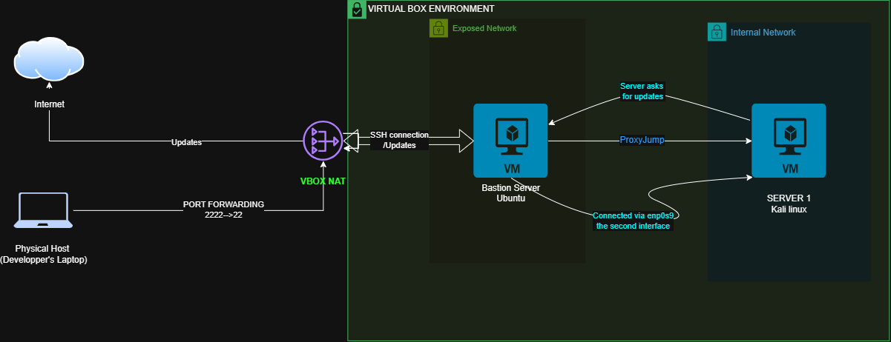

# Zero Trust Infrastructure

> **Designing secure Linux infrastructure using Zero Trust principles.**

A production-inspired infrastructure project that secures administrative access through a hardened SSH Bastion Host using OpenSSH, public key authentication, network segmentation, and stateful firewall policies.

The objective is not simply to configure individual technologies, but to understand how secure infrastructure is designed from first principles by building a complete environment, validating each security decision, and documenting the engineering process from deployment to hardening.

---

## Overview

Modern infrastructure should never expose internal systems directly to users or administrators.

This project implements a Zero Trust approach where every administrative connection is controlled through a dedicated Bastion Host acting as the single entry point to the internal network.

The environment combines Linux networking, OpenSSH, nftables, and network segmentation to demonstrate how secure remote administration can be implemented in a production-inspired environment.

---

## Security Objectives

The project was built with the following objectives:

- Centralize administrative access through a hardened SSH Bastion Host.
- Eliminate direct access to internal systems.
- Secure authentication using SSH Public Key Authentication.
- Restrict network traffic using stateful firewall policies.
- Apply Zero Trust principles to Linux infrastructure.
- Document every engineering decision throughout the implementation.

---

## System Architecture

The infrastructure is designed around a single principle:

> **Never trust the network. Always verify administrative access.**

The Bastion Host acts as the only entry point to the internal infrastructure while firewall policies and network segmentation prevent unauthorized communication between systems.

<p align="center">
  
</p>

---

## Key Features

| Category | Implementation |
|-----------|----------------|
| Secure Remote Access | SSH Bastion Host |
| Authentication | SSH Public Key Authentication |
| Administrative Access | SSH ProxyJump |
| Firewall | nftables |
| Network Security | Stateful Packet Filtering |
| Network Segmentation | Isolated Internal Network |
| Routing | Linux Router |
| Operating System | Ubuntu Server |

---

## Implemented Components

The current implementation includes the following engineering components:

| Component | Status |
|-----------|:------:|
| SSH Bastion Host | ✅ |
| OpenSSH Hardening | ✅ |
| SSH Public Key Authentication | ✅ |
| SSH ProxyJump | ✅ |
| nftables Firewall | ✅ |
| Linux Routing | ✅ |
| Network Segmentation | ✅ |
| Technical Documentation | 🚧 |
| Architecture Diagrams | 🚧 |

---

## Repository Structure

```text
.
├── configs/        # OpenSSH and nftables configurations
├── diagrams/       # Architecture diagrams
├── docs/           # Project documentation
├── images/         # Screenshots
├── scripts/        # Deployment and automation scripts
└── README.md
```

---

## Documentation

This repository focuses on documenting both the implementation and the reasoning behind the infrastructure.

Current documentation covers:

- Infrastructure architecture
- Deployment process
- OpenSSH configuration
- Network topology
- Security design decisions

The documentation will continue to evolve as the project grows.

---

## Future Enhancements

The current implementation provides the foundation of the infrastructure. Future improvements may include:

- Fail2Ban integration
- SSH Certificate Authentication
- Multi-Factor Authentication (MFA)
- VPN-based administrative access
- Infrastructure automation
- Additional hardening techniques

---

## Project Status

**Current Stage:** Documentation & Refinement

The infrastructure has been successfully implemented and validated in a virtualized laboratory environment.

Current work focuses on improving documentation, producing professional architecture diagrams, and refining the repository before introducing additional security features.

---

## License

This project is released under the MIT License.

See the [LICENSE](LICENSE) file for more information.
