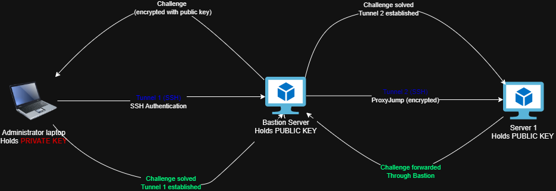

# SSH Authentication & ProxyJump Flow

## Overview

This diagram illustrates the SSH authentication process implemented in this project.

Rather than exposing the internal server directly to the network, all administrative access is centralized through a hardened Bastion Host. The administrator authenticates using public-key cryptography, and SSH ProxyJump transparently forwards the connection to the internal server.

This approach minimizes the attack surface while ensuring that every SSH connection is individually authenticated.

---

## Authentication Process

  

##Phase 1: Bastion Server Authentication (Tunnel 1)
Initiation: The administrator initiates an SSH connection from the local laptop targeting the Bastion Server.

Challenge Generation: The Bastion Server generates an encryption challenge and sends it back to the client.

Key Verification: The administrator's laptop signs the challenge using the local PRIVATE KEY.

Tunnel Established: The Bastion Server verifies the signature against its stored PUBLIC KEY, successfully authenticates the session, and Tunnel 1 is established.

##Phase 2: Internal Target Forwarding (Tunnel 2 via ProxyJump)
Jump Command: Leveraging the active session on the Bastion, the client requests a jump/forward connection through to Server 1.

Forwarded Challenge: The Bastion Server forwards the new connection request and authentication challenge onward to Server 1.

Internal Verification: Server 1 issues a cryptographic challenge back through the Bastion, which is signed by the administrator's private key and verified against Server 1's stored PUBLIC KEY.

End-to-End Tunnel Established: Once verified, Tunnel 2 is fully established, allowing secure, encrypted management traffic to flow through the Bastion directly to Server 1.
